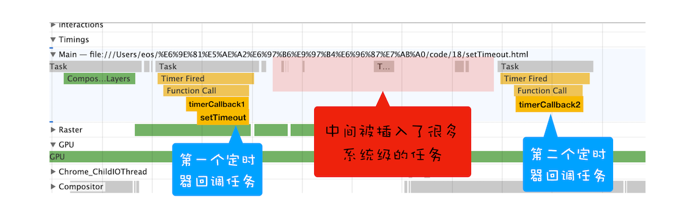
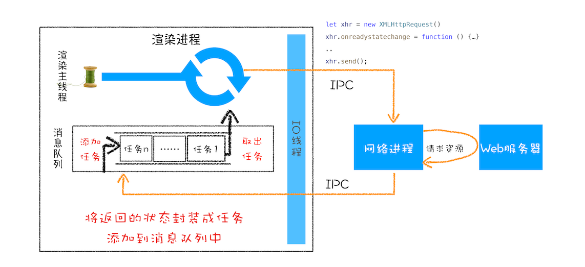
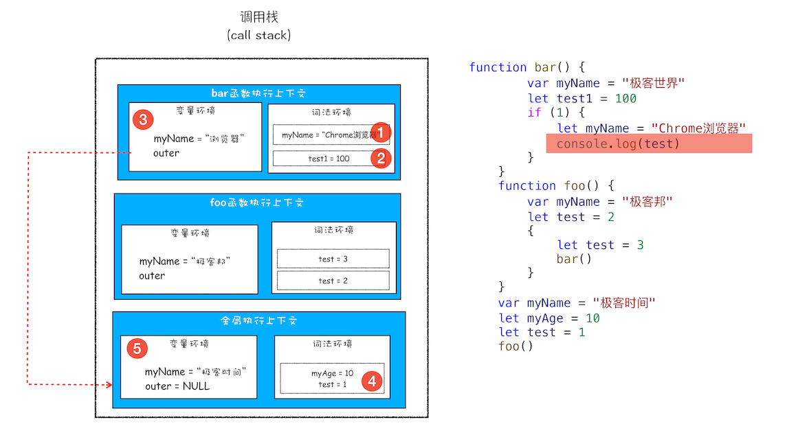
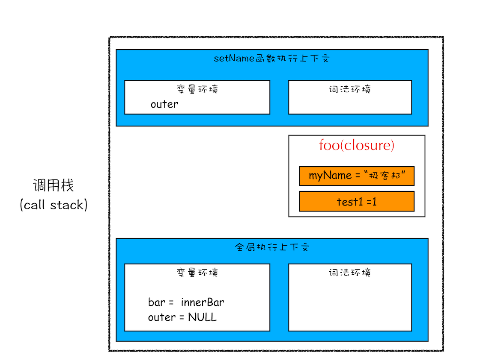

###JS的数据类型：弱类型的动态语言

- 弱类型：JS引擎自动算出变量的类型
- 动态：使用同一个变量保存不同类型的数据

###内存空间：

- 代码空间

- 栈空间：保存数值类型的变量

- 堆空间：保存对象、函数（也是一种对象）的变量（堆空间的存在时为了更快的切换函数调用栈）

  ```javascript
  function foo(){
      var a = "极客时间"
      var b = a
      var c = {name:"极客时间"}
      var d = c
  }
  foo()
  ```

  

###JavaScript代码的执行流程：


1. ####编译阶段：

   - 准备执行上下文：

     类型：

     1. 全局执行上下文，生命周期：整个页面存在时
     2. 函数执行上下文，生命周期：函数调用 ---> 退出函数

     内容：

     1. 词法环境：（代码块中维持）

        - 使用let和const声明的变量
        - 维持小型栈结构，当运行到某作用域时，将该作用域压入栈，并写入作用域内的变量，当执行完该代码块后，栈弹出，销毁栈内变量

     2. 变量环境：（函数、全局中维持）

        变量提升：

        1. var定义的变量：提升到当前的执行上下文的变量环境中，设置为undefined
        2. 声明的函数：提升到当前的执行上下文的变量环境中，将函数的实质保存在堆内存，变量环境中保存指针指向堆内存

2. ####执行阶段：

   ##### 事件循环机制：

   - 事件类型：
     - 宏任务：
       1. 渲染事件：解析 DOM、样式计算、布局计算、CSS 动画等。
       2. 用户交互事件：输入事件（鼠标滚动、点击、移动）
       3. JavaScript 执行、WebSocket、JavaScript 定时器
       4. 网络请求完成，文件读写
     - 微任务：在当前宏任务结束前执行
       1. MutationObserver 监控某个 DOM 节点，通过JS修改DOM节点相关的内容
       2. Promise，调用Promise.resolve( )和Promise.reject( )时，产生微任务，在当前宏任务结束前执行，函数出栈
   - IO线程：渲染进程中用来接收其他进程传来的消息的线程·，这些消息被组装成任务发送给渲染主线程

   

   - 延迟队列：定时器专用

     1. 当调用函数时，触发一个setTimeout，将其添加到延迟队列中，每当处理完一个消息队列中的任务，处理一些系统级的任务，再查看延迟队列中的任务，获取到期任务并执行，而后执行消息队列中的下一个任务

     2. 嵌套调用setTimeout（递归），系统会设置最短时间间隔，每隔4毫秒执行一次

     3. 未激活的页面，setTimeOut的执行最小间隔时间是1秒一次

        

   - XMLHttpRequest运行机制

     在调用请求函数时，发起xhr.send请求，并注册xhr.error, xhr.ontimeout,xhr.onreadystatechange等回调函数，等请求结果回来后，调用对应状态的回调函数，将其添加到消息队列中

     

   - 判断是否执行退出当前页面事件：页面主线程设置一个推出标志的变量，每当执行完一个任务，检查是否设置退出标志，有则关闭页面主线程，退出

   - 微任务：

   - 单个任务执行过久，导致页面卡顿：

   #####调用栈：（入栈 ---> 出栈）

   - 栈溢出：调用栈是有大小的，当入栈的执行上下文超过一定数目，JS引擎会报错

     出现场景：递归的出口条件设置错误，无法出口

     

   #####赋值：

   暂时性死区：使用let或const定义变量，在该代码块中，定义前调用它，会报错

   

   #####作用域：

   程序中定义变量的区域，决定变量的生命周期

   1. 全局作用域：全局执行上下文的词法环境 ---> 全局执行上下文的变量环境
   2. 函数作用域：函数执行上下文的词法环境 ---> 函数执行上下文的变量环境
   3. 块级作用域：是词法环境中的一个栈，使用"{ }"包裹的一段代码，当执行结束该代码块，即弹出

   

   

   #####作用域链：

   每一个执行上下文的变量环境都包含一个外部引用，用来指向外部的执行上下文

   作用域链的查找和函数调用无关，和函数定义时所在的执行上下文有关

   

   #####闭包：

   - 定义：

     在A执行上下文中定义一个变量obj，将B执行上下文中的一个对象赋值给obj，obj中的属性保持对B执行上下文中的变量的引用

     当函数执行完后，函数出栈，但函数中的变量引用被保存下来，形成闭包

     ```javascript
     function foo() {
         var myName = "极客时间"
         var innerBar = {
             getName:function(){
                 return myName
             },
             setName:function(newName){
                 myName = newName
             }
         }
         return innerBar
     }
     var bar = foo()
     bar.setName("极客邦")
     bar.getName()
     console.log(bar.getName())
     ```

     变量查找方向：当前执行上下文 ---> 闭包 ---> 外部引用的执行上下文（这里为全局）

     

     闭包是被保存到了堆空间中

     

   - 闭包回收：

     当持有闭包的对象是全局对象时，等页面关闭时才销毁

     当持有闭包的对象是某函数中的变量时，函数执行结束即销毁

   #####this：

   在对象内部的方法中使用对象内部的属性

   

   this的指向：

   - 全局执行上下文的this：window对象

   - 函数的this：哪个对象调用this，this指向哪个对象

     this的指向：

     ```javascript
     var myObj = {
       name : "极客时间", 
       showThis: function(){
         // 指向myObj
         console.log(this)
         // 指向全局对象window，因为，bar函数创建了属于自己的执行上下文，相当于在全局对象中调用
         function bar(){console.log(this)}
         bar()
       }
     }
     myObj.showThis()
     // publicObj获取le指向堆内存的指针，指向showThis函数
     let publicObj = myObj.showThis
     //	函数在全局对象中调用，函数的this指向window对象
     publicObj()
     ```

     setTimeout中的this指向：

     ```javascript
     var name= 1;
     var MyObj = {
       name: 2,
       showName: function(){
         console.log(this.name);
       }
     }
     // 指向window
     setTimeout(MyObj.showName,1000)
     // 指向Myobj
     
     //箭头函数
     setTimeout(() => {
         MyObj.showName()
     }, 1000);
     //或者function函数
     setTimeout(function() {
       MyObj.showName();
     }, 1000)
     ```

     

     改变this指向的方法：

     ```javascript
     let bar = {
       myName : "极客邦",
       test1 : 1
     }
     function foo(){
       this.myName = "极客时间"
     }
     foo.call(bar)
     foo.apply(bar)
     foo.bind(bar)
     ```

##### 垃圾回收：

栈内存：

​	通过移动记录当前执行状态的指针，当函数调用结束，指针下移，再调用另一个函数时，将会覆盖原函数


堆内存：

1. 代际假说：

   - 新生代：大部分对象存在内存时间很短；由副垃圾回收器回收
   - 老生代：不死的对象，会活很久；由主垃圾回收器回收

   垃圾回收过程：

   1. 标记空间中的活动对象和非活动对象
   2. 回收非活动对象占据的内存
   3. 内存整理：将不连续的内存空间进行整理

   副垃圾回收器：

   1. 新加入的对象先放到对象区域，当对象区域快被写满时，执行一次垃圾清理操作：
      1. 标记活动对象
      2. 将活动对象复制到空闲区域（有序排列）
      3. 将对象区域的内存全部删除
      4. 对象区域与空闲区域互换角色
   2. 经过两次垃圾回收还存活的对象，被移动到老生区

   

   主垃圾回收器：

   1. 对象占用空间大，对象存活时间长

   2. 垃圾回收方法：

      1. 标记-清除：标记需要清除的垃圾

         

      2. 标记-整理：将存活的对象重新有序的整理后，清除端边界以外的内存

         

      垃圾回收对JS主线程的影响以及解决方案：

      全停顿：当JS主线程执行垃圾回收时，页面会全面停顿。

      回收新生代垃圾时，停顿感觉不明显。回收老生代垃圾时，因对象过大，时间过长，感觉明显。因此，V8引擎将老生代的整理标记过程分为无数个子过程执行（**增量标记**）

      

