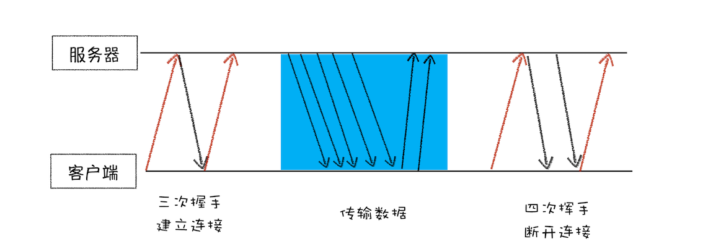
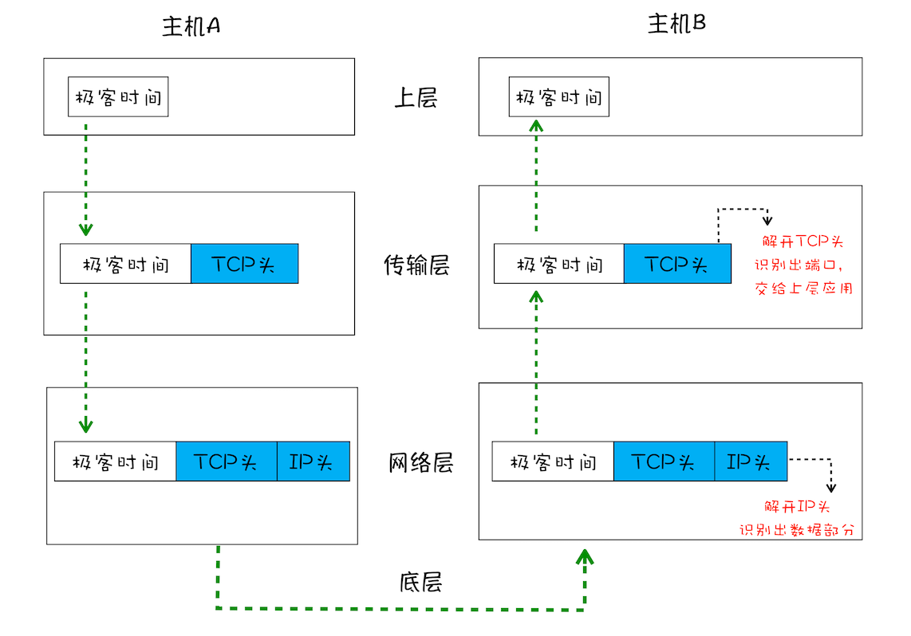
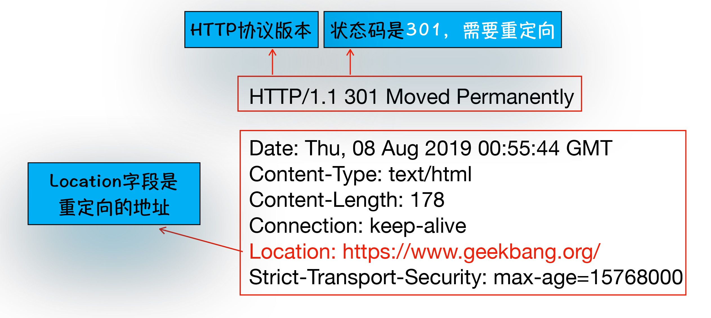
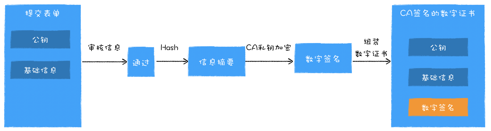
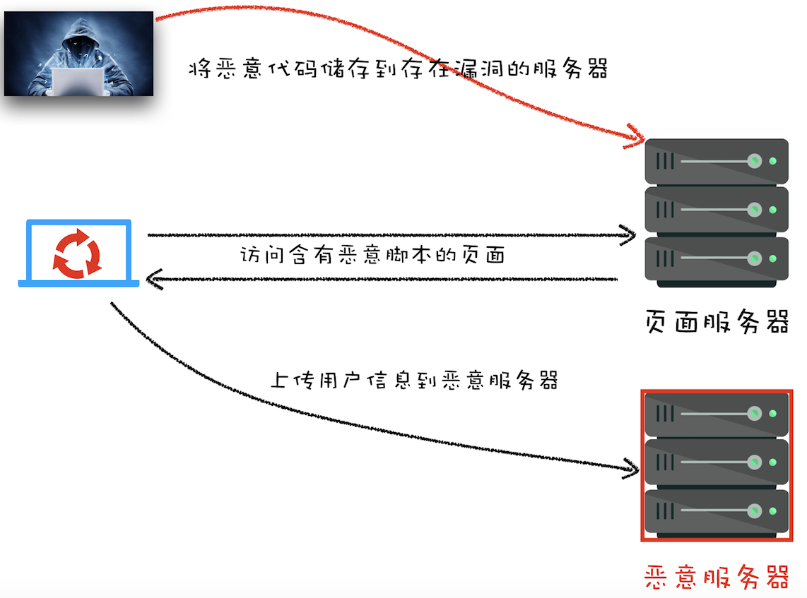
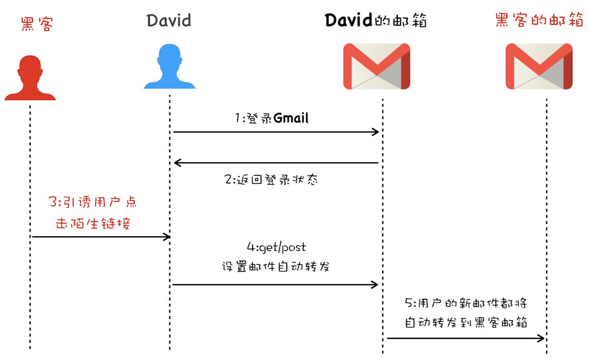
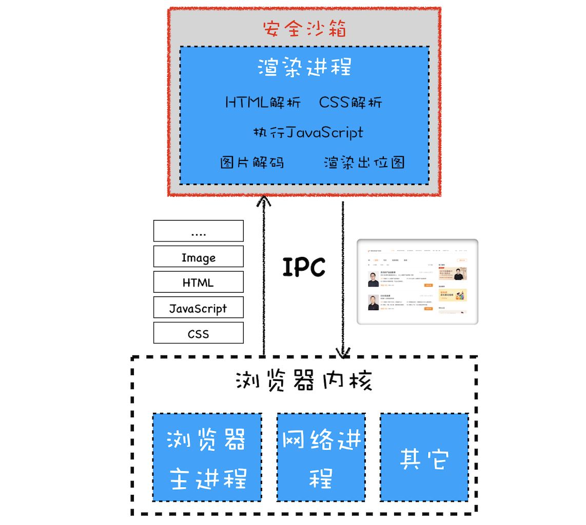

###HTTP请求

- #### 协议

  #### TCP协议

  

  1. 构建请求行

     ```javascript
     GET /index.html HTTP1.1
     ```

  2. 查找缓存：

     - 若DNS缓存中存在需要请求的服务器域名，则减少一次HTTP请求（用于获取对应的IP地址）
     - 若浏览器端缓存该文件，且在有效期内，则直接使用该缓存文件
     - 若浏览器缓存该文件，但过了有效期（通过查询响应头中的Cache - Control:Max - age ），则向服务器发送请求（请求头：If - None - Match）,
     - 服务器获取请求,查询该数据有没有修改，若没有，则返回304状态码和响应头（Not-Modifined）

     

  3. 如果本地计算机中不存在该缓存文件，进入网络请求：

     1. 准备IP和端口：

        - 通过DNS数据缓存服务器向DNS域名系统，访问URL对应的IP地址（这是一次网络请求）

        - 在通过DNS数据缓存服务器时，该服务器先在自身的内存中查找，是否缓存了该URL对应的IP地址，若有，则直接返回，可减少一次网络请求

     2. 等待TCP队列：若同一域名下的请求多于6个，多出来的请求进行排队

     3. 建立TCP连接（三次握手）

        

     4. 数据传输：

        **路径**

        - 用户数据（应用层）
        - TCP头（传输层）：
          1. 端口号，数据包传输到指定应用程序
          2. 数据包校验机制，如果数据包丢失，则需要重传
          3. 数据包排序，按标定顺序重新组装数据包
        - IP头（网络层）：服务器和浏览器两台机器的IP信息，数据包传输到目的主机
        - 底层传输

        

        **过程**

        1. 浏览器发送请求行：请求方法、请求URI、HTTP协议版本

           - GET： 发送想要获取的资源
           - POST：准备好数据，通过请求体发送给服务器

        2. 服务端处理HTTP请求流程：返回请求的数据内容

           **包含信息**

           - 响应行：协议版本和状态码
           - 响应头：放服务器自身的信息，数据生成时间，cookie信息，返回数据的类型等
           - 响应体：请求回来的数据（用于渲染页面）

           **重定向**（根据状态码301及响应头信息，浏览器自动重定向）

           如果返回的数据包含301状态码及location字段，浏览器将会获取location字段中的地址，并为该地址重新导航

           

           **保持登陆状态**（根据请求头的cookie信息判断）

           - 用户首次登录时，服务端第一次将数据返回给客户端时，会在响应头中包含Set-cookie的字段，
           - 客户端收到该字段后，会在本机的内存中保存该cookie信息，
           - 当第二次登录时，请求头会带上该cookie信息，服务器根据该cookie信息判断该用户的登录状态

     5. 断开连接（四次挥手）：

        当数据传输结束后，该请求所创建的TCP连接断开

        如果响应头中包含：Connection: keep-alive,则不会断开连接，下一个请求将直接在该TCP连接中进行

        -----

        

  ####UDP协议

  协议特点：

  - 连接：不需要建立TCP连接（三次握手），直接传输
  - 丢包处理：若数据错误直接丢包，不通知
  - 数据组装：大数据包拆分成小数据包传输，当小数据包传输完成后，不进行排序，不按照正确顺序组装小数据包（按小数据包到达的先后顺序组装？）

-----

- #### 安全

  #### HTTPS

  1. 安全层：HTTP的明文传输使得传输过程毫无安全性可言，因此，在TCP和HTTP之间插入一个安全层

  2. 数字证书：黑客修改DNS中IP的地址，使浏览器访问黑客服务器，因此添加数字证书证明服务器身份

  **安全层职责**：

  - 对发起HTTP请求的数据加密：对传输的数据进行对称加密，产生对称秘钥，使用数字证书提供的服务器公钥加密对称秘钥，并传输
  - 对接收到的HTTP内容进行解密：传输回来的数据，使用对称秘钥进行解密（由于对称秘钥使用服务器公钥进行加密，所以，中间人劫持不能破解出对称秘钥）

  

  **数字证书**：

  ​	权威机构CA(Certificate Authority)颁发数字证书(Digital Certificate)

  **证书的作用**

  - 通过数字证书向浏览器证明服务器的身份

  - 数字证书中包含服务器公钥

  **证书申请**

  1. 服务器准备一套私钥和公钥，私钥自己留着

  2. 服务器向CA机构提供公钥、公司、站点等信息，并等待认证

  3. CA通过多种渠道证明该服务器合法，信息审核通过

  4. CA向服务器颁发数字证书，证书中包含签名

     **签名过程**：服务器提供的明文信息  ----(Hash函数加密)---> 信息摘要 ---(使用服务器私钥加密)--->  数字签名

  

  **浏览器验证数字证书**

  1. 数字证书上的明文 --(CA提供的Hash函数加密) ---> 信息摘要A

  2. 数字证书上的数字签名 ---(证书上的公钥解密) ---> 信息摘要B

  3. 信息摘要A === 信息摘要B ？服务器合法， 是对应的服务器  ：服务器非法

     

  ------

  

  #### 第三方攻击

  ##### 攻击目的

  1. 窃取Cookie信息：获取用户信息，在其他地方模拟用户进行登陆
  2. 监听用户行为：通过addEventListener事件，获取用户键盘输入内容，从而套取账户密码
  3. 修改DOM：如制作假的登陆窗口，欺骗用户输入用户名和密码等
  4. 在页面生成浮窗广告
  5. ....

  ##### 攻击类型

  - 跨站点攻击（XSS）: 黑客往HTML文件中或DOM中注入恶意脚本，从而在用户浏览页面时，利用注入的恶意脚本对用户实施攻击的一种手段

    1. 存储型XSS攻击

       将恶意代码存储到有漏洞的页面服务器上 ---> 客户端访问该页面 ---> 恶意代码将用户信息发送到恶意服务器中

       

       例子：

       - 背景：音乐软件中，用户可自由创建专辑。
       - 黑客向服务器植入恶意代码：黑客登陆该网站创建一张公开专辑，该专辑实际上是一段访问恶意服务器的HTTP请求，保存到服务器中
       - 用户访问该恶意服务器：当用户在网页上点开这张公开专辑时，即访问恶意服务器
       - 恶意服务器获取用户的cookie等信息

       对应措施：客户端针对用户自定义的内容必须进行关键字过滤，不让客户植入其他程序

    2. 反射型XSS攻击

       与存储型攻击的不同点：Web服务器不会存储反射型XSS攻击的恶意脚本

       正常用户主动向服务器发送含有加载恶意代码的网络请求，随后，HTTP请求加载恶意代码，并将恶意脚本返回给客户端

       对应措施：当黑客通过QQ群或邮件等诱导用户去点击恶意连接时，不要理会

    3. 基于DOM的XSS攻击

       通过WIFI路由器或本地恶意软件，在web资源传输过程或者在用户使用页面的过程中修改Web页面的数据，无需经过服务器

  - 跨站请求伪造(CSRF)：（黑客攻击利用用户在目标站点的已登录状态，诱导用户点击第三方站点，第三方站点恶意访问目标站点）

    1. GET请求：第三方站点获得用户的登录状态及目标站点的接口（如转账接口），向目标站点发起转账请求
    2. POST请求：与GET请求同理，只是目标站点的接口是POST请求
    3. 引诱用户点击链接：
       - 用户登录指定网站后，服务器返回登录状态给用户，包括cookie和session
       - 黑客通过诱导用户点击黑客制作的链接，此时正处于登录状态的用户通过这个链接，再次访问指定网站
       - 服务器认为这是处于登录状态的用户本人所发起的合法请求
       - 该链接实际上是对服务器发起请求，通过get、post、等请求达到黑客想要做的事情
       - 黑客获取大量用户的个人信息后，证明自己是用户本人，并向域名供应商申请重置账户和密码

    

  -----

  

  #####对应措施

  1. **应对XSS攻击**：(Cross Site Scripting)

     - 阻止恶意JS脚本的注入

       1. 服务端对注入的关键字符进行转码或过滤

       2. 充分利用CSP（内容安全策略）

          - 限制加载其他域的资源
          - 禁止向第三方域提供数据
          - 禁止执行内联脚本和未授权的脚本
          - 提供上报机制

       3. 使用HTTPOnly属性：

          将Cookie添加HTTPOnly标志，因此，无法通过JS来读取这段Cookie

       4. 限制输入长度，添加验证码

     - 阻止恶意消息的发送

  2. **应对CSRF攻击**：（Cross-site request forgety）

     1. Set-cookie时带上SameSite属性

        第三方网站向服务器发起请求，禁止发送cookie等关键信息给服务器

        SameSite: 

        - Strict:凡是第三方请求，都不会携带cookie
        - Lax:第三方网站提交Get方式会携带cookie，但是post请求，通过<iframe>加载的url不会携带cookie
        - None:在任何情况下都会发送cookie数据

     2. 验证请求的来源站点

        HTTP请求头

        - Referer：记录该HTTP请求的来源地址（URL），但第三方可以选择不上传
        - Origin：包含域名信息，不包含路径。通过XMLHttpRequest、Fetch发起跨站请求或者通过Post方法发送请求时，都会带上Origin属性

     3. CSRF Token

        - 当浏览器向服务器发起请求时，服务器生成一个CSRF Token，并将该字符串植入返回的页面中。
        - 当浏览器发起转账请求时，要带上页面中的CSRF Token，如果服务器没有收到，或返回不正确，则拒绝请求。

  3. **同源策略(Same-origin policy)**: 

     在某网页中只能请求协议，域名，端口完全一致 (URL同样) 的资源，跨域请求资源不被允许

     **同源页面的权利：**

     1. DOM层面
     2. 数据层面：读取当前站点的Cookie、IndexDB、LocalStorage等数据
     3. 网络层面：不能通过XMLHttpRequest和Fetch等方式将站点数据发送给不同源的站点

     **对同源页面限制的修改**

     1. 在HTML文件中插入加载JS代码的标签，该标签内的资源（URL）可以是不同源的
     2. 跨域资源共享：进行跨域请求资源
     3. 跨文档消息机制：通过window.postMessage的JS接口对不同源的DOM进行通信

     ------

     

  - ##### 浏览器安全

    **缓冲区溢出**

    利用浏览器的漏洞，入侵浏览器进程内部，可以读取和修改浏览器进程内部的任意内容，还可以穿透浏览器，在用户的操作系统中悄悄安装恶意软件，监听用户键盘输入信息以及读取用户硬盘的文件内容

    **安全沙箱**

    

    - 在渲染进程和操作系统之间建一堵墙，即恶意程序只能在渲染进程中，但不能获取渲染进程以外的操作权限
    - 如在渲染进程中需要访问系统资源时，需要通过浏览器内核访问，并通过IPC将结果转给渲染进程
    - 安全沙箱最小保护单位是进程
