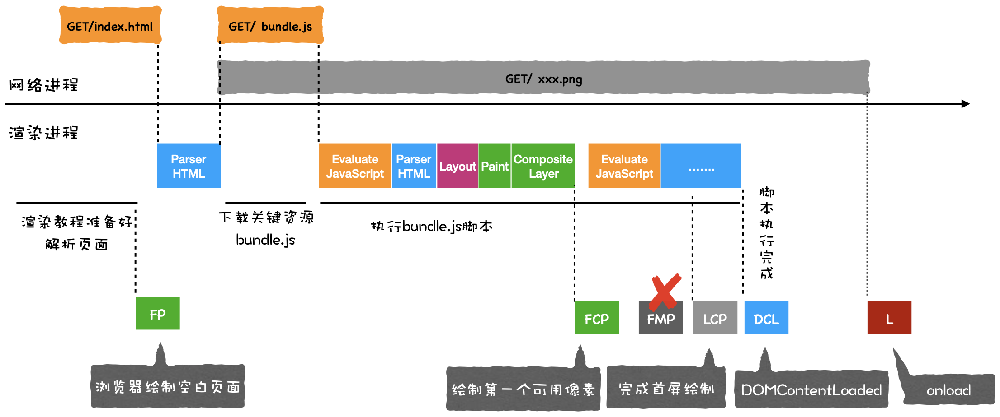

### 进程与线程

- 进程是一个程序的运行实例：在程序启动时，操作系统会为程序开辟一块内存，用于存放代码，运行中的数据和一个执行任务的主线程，这个运行环境叫进程。
  1. 进程关闭后，操作系统会回收进程所占用的内存
  2. 进程之间的内容相互隔离：每个进程只能访问自己占有的数据，避免进程A的数据写入进程B中

- 线程：是不能单独存在的，它是由进程来启动和管理的

- 进程与线程的关系：
  1. 进程中的任意一线程执行出错，导致进程崩溃
  2. 线程之间共享进程的数据

###单进程浏览器时代：

浏览器的所有功能模块都是运行在同一个进程中的，模块包括网络、插件、JS运行环境、渲染引擎、页面等

导致的问题：

1. 不稳定：运行在单进程中的插件一旦崩溃，则引起整个浏览器崩溃，即单个页面崩溃带来整个浏览器崩溃
2. 不流畅：
   - 渲染模块、JS执行环境、插件都是运行在同一个线程中的，同一时刻只能运行一个模块
   - 内存泄漏：内存如果不能完全回收，导致使用时间越长，内存占用越高，浏览器越慢
3. 不安全：
   - 插件：可以获得操作系统的任意资源，运行一个插件时，能完全操纵你的电脑
   - 页面脚本：通过浏览器漏洞获取系统权限

### 多进程架构：

**进程详情**：

- 浏览器进程：界面显示、用户交互、子进程管理、存储功能
- 渲染进程：一个标签页一个渲染进程（同源的标签页共用一个渲染进程），出于安全考虑，渲染进程都是运行在安全沙箱内
- GPU进程：UI绘制图片
- 网络进程：负责页面的网络资源加载
- 插件进程：负责插件的运行

**问题**：

- 更高的资源占用：消耗更多的内存
- 更复杂的体系架构：各模块耦合性高，拓展性差

打开一个页面，最起码需要四个进程：

1. 浏览器进程：接收用户输入的URL请求（用户搜索关键字 => 合成带关键字的URL；URL => 添加协议合成完整的URL）, 触发beforeunload钩子

2. 网络进程：发起真正的URL请求 （查找本地是否有缓存资源 => 若无，进入网络请求流程）

3. 浏览器进程：接收响应头数据，解析响应头数据

   - 状态码是301或302，则重定向到其他URL，再次发起URL请求（回到第一步）
   - 状态码200，浏览器继续处理该请求，通知渲染进程准备
   - 检查Content-type类型，确定返回的数据是什么格式，并按照数据格式进行下一步的处理
     1. application/octet-stream 类型：将请求提交给浏览器的下载管理器
     2. text/html 类型：浏览器继续进行导航流程，向渲染进程提交“提交文档”消息

4. 准备渲染进程：和网络进程建立数据通道，通知浏览器进程准备接收页面数据

   1. 创建渲染进程：Chrome为每一个页面分配一个渲染进程，但同源的URL（相同的协议、根域名）使用同一个渲染进程
   2. 接收浏览器进程"提交文档"的消息后，和网络进程建立传输数据"管道"
   3. 文档数据传输完毕，渲染进程返回“确认提交”的消息给浏览器进程

5. 浏览器进程：移除旧文档，更新浏览器进程中的页面状态

   接收“确认提交”的消息后，更新以下内容：

   - 安全状态
   - 地址栏的URL
   - 前进后退的历史状态
   - 更新Web页面

6. 页面渲染

   

   **如果HTML文件中包含引入外部CSS文件或JS文件，则进行预解析，下载引入文件，等解析到文件所在位置时，在文件下载完成后执行**

   若JS文件后仍有DOM元素未解析，暂停解析DOM元素，并首先解析CSS文件（若CSS文件未下载完成，则等待其下载完成再执行），再解析JS文件

   

   - 构建DOM树：

     1. HTML文件：网络进程加载数据（加载多少数据，HTML解析器就解析多少数据）

     2. HTML解析器解析：

        1. 将字节流转化为Token，维持一个栈结构

           

        2. 将Token解析为DOM节点，根据栈结构，判断该DOM节点的父元素

        3. 将节点添加到DOM树中

     3.  DOM树（保存在内存中）

   - 样式计算：

     1. 将CSS转换为浏览器能够理解的结构：CSS ----> styleSheets(CSSOM)

     2. 转换样式表中的属性值，使其标准化：

        

     3. 计算DOM树中每个节点的具体样式：

        根据CSS继承、层叠规则、UserAgent样式，计算每个DOM节点的最终样式，并保存在ComputedStyle结构中

   - 布局阶段

     计算DOM树中可见元素的几何位置

     1. 创建布局树：只包含可视元素的布局树
     2. 计算布局：计算每一个元素的几何位置，将布局运算的结果写回布局树

   - 分层

     渲染引擎需要为特定的节点生成专门的图层，并对应生成一棵图层树

     

     - 如果一个节点没有对应的层，该节点从属于父节点的图层

     - 拥有以下属性的节点单独一层：

       1. 拥有层叠上下文

          

       2. 需要剪裁的地方

          

     

   - 绘制

     把一个图层的绘制拆分成多个小的绘制指令，按顺序组成绘制列表：

     

   - 分块

     视口：一个页面可能很大，用户能看到的一部分称为视口

     由于用户只能看到视口部分的页面，因此，**合成线程**将图层划分为图块

     

   - 光栅化和合成

     1. 栅格化：按照绘制列表中的指令生成图片，每一个图层对应一张图片
     2. 合成：合成线程将每一个图层对应的图片全部合成一张图片，保存到后缓冲区中，并提交给浏览器进程（发送"DrawQuad"指令）

     **后缓冲区一旦有图片，则和前缓冲区交换位置**

   - 显示：

     浏览器进程(接收"DrawQuad"指令)后，每秒固定读取60次GPU的前缓冲区中的图片，并将其显示到显示器上

     

   - 重排：需要更新完整的渲染流水线，触发重新布局

     ​	更新元素的几何属性

     

   - 重绘：更新元素的绘制属性，不会重新布局

     ​	修改元素的属性并没有引起几何位置的变化（如颜色改变）

     

   - 合成：既不需要布局，也不需要绘制的属性

     ​	动画效果

     

     

